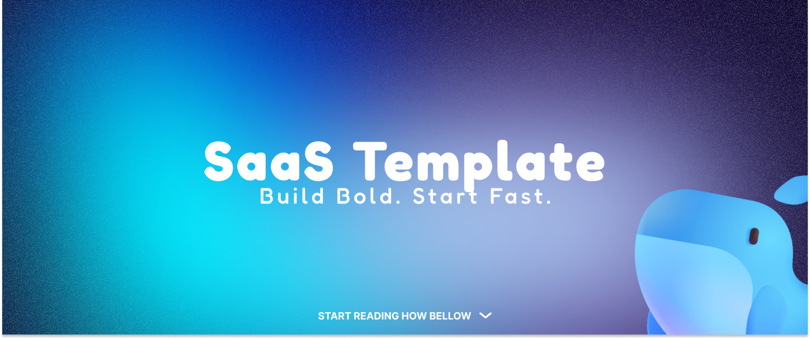

<div align="center">
  

**A modern, production-ready full-stack web application template**

Built with Next.js 15, TypeScript, Tailwind CSS, Drizzle ORM, PostgreSQL, BetterAuth, and ShadCN UI

</div>

---

## 🧰 Tech Stack

<div align="center">


</div>

---

## ✨ Features

<details>
<summary>🔐 Authentication & Authorization</summary>

- **Secure Login/Registration**: Email and password authentication with validation
- **Email Verification**: OTP-based email confirmation system
- **Role-Based Access Control**: Admin, user, and guest role management
- **Password Reset**: Secure password reset flow with email verification
- **Session Management**: JWT-based session handling

</details>

<details>
<summary>🎨 User Interface</summary>

- **Modern Design System**: Beautiful, accessible components with ShadCN UI
- **Responsive Design**: Mobile-first approach with Tailwind CSS
- **Dark/Light Mode**: Theme switching with persistent user preferences
- **Loading States**: Skeleton loaders and progress indicators
- **Form Validation**: Real-time validation with helpful error messages

</details>

<details>
<summary>🛠️ Developer Experience</summary>

- **Type Safety**: Full TypeScript coverage with strict mode
- **Database Management**: Type-safe queries with Drizzle ORM
- **Code Quality**: ESLint, Prettier, and pre-commit hooks
- **Hot Reload**: Instant feedback during development
- **API Documentation**: Auto-generated API docs

</details>

<details>
<summary>🚀 Performance & Production</summary>

- **Optimized Builds**: Next.js optimizations for production
- **Database Pooling**: Connection pooling for better performance
- **Caching Strategy**: Built-in caching for API routes and pages
- **Docker Ready**: Production-ready containerization
- **Health Checks**: Built-in health monitoring endpoints

</details>

---

## 🚀 Getting Started

### Prerequisites

- **Node.js** ≥18 - [Download](https://nodejs.org/)
- **pnpm** (recommended) or npm - [Install pnpm](https://pnpm.io/installation)
- **Docker & Docker Compose** - [Get Docker](https://docs.docker.com/get-docker/)
- **Git** - [Install Git](https://git-scm.com/downloads)

### Installation

#### 1. Clone the Repository
```bash
git clone https://github.com/CianCode/Saas-Template.git
cd Saas-Template
```

#### 2. Install Dependencies
```bash
pnpm install
# or
npm install
```

#### 3. Environment Setup
```bash
cp .env.example .env
```

Update `.env` with your configuration:

#### 4. Start PostgreSQL
```bash
docker compose up -d
# Wait 10–15 seconds for database to be ready
```

#### 5. Set Up the Database Schema
```bash
# Push schema
pnpm db:push

# Or run migrations
pnpm db:migrate
```

#### 6. Seed the Database (optional)
```bash
pnpm db:seed
```

#### 7. Start Development Server
```bash
pnpm dev
```

Open [http://localhost:3000](http://localhost:3000) to see your app.

---

## 📁 Project Structure

```
Saas-Template/
├── app/                        # Next.js App Router
│   ├── (auth)/                 # Authentication pages
│   ├── api/                    # API routes
│   ├── dashboard/              # Protected pages
│   ├── globals.css             # Global styles
│   ├── layout.tsx              # Root layout
│   └── page.tsx                # Home page
├── components/                 # Reusable components
├── lib/                        # Utilities (auth, db, validations)
├── db/                         # Drizzle schema, migrations, seeds
├── hooks/                       # Custom hooks
├── types/                       # TypeScript types
├── public/                      # Static assets
├── docker-compose.yml           # Docker config
├── drizzle.config.ts            # Drizzle ORM config
├── next.config.js               # Next.js config
├── tailwind.config.ts           # Tailwind CSS config
└── tsconfig.json                # TypeScript config
```

---

## 📚 Available Scripts

### 🏗️ Development
```bash
pnpm dev           # Start development server
pnpm dev:debug     # Start dev server in debug mode
pnpm dev:clean     # Clean & start fresh dev server
```

### 📦 Build & Production
```bash
pnpm build         # Build app for production
pnpm start         # Start production server
```

### 🧹 Linting
```bash
pnpm lint          # Run linter
pnpm lint:fix      # Lint & auto-fix issues
pnpm lint:strict   # Lint in strict mode (no warnings)
```

### 🗄️ Database
```bash
pnpm db:generate   # Generate Drizzle migrations
pnpm db:push       # Push schema to DB
pnpm db:migrate    # Run migrations
pnpm db:studio     # Open Drizzle Studio
pnpm db:seed       # Seed DB with initial data
pnpm db:reset      # Reset DB & seed fresh data
```

### 🎨 ShadCN UI
```bash
pnpm ui:add        # Add a new component
pnpm ui:update     # Update components
```

---

## 🤝 Contributing

See [CONTRIBUTING.md](CONTRIBUTING.md).

1. Fork the repository
2. Create feature branch
3. Add changes & tests
4. Commit & push
5. Open Pull Request

---

## 📄 License

MIT License — see [LICENSE](LICENSE)

---

## 🙏 Acknowledgments

- [Next.js](https://nextjs.org/)
- [ShadCN UI](https://ui.shadcn.com/)
- [Drizzle ORM](https://orm.drizzle.team/)
- [BetterAuth](https://www.better-auth.com/)
- [Tailwind CSS](https://tailwindcss.com/)

---

## 🌟 Show Your Support

- ⭐ Star the repo
- 🍴 Fork it
- 📢 Share with others
- 🐛 Report bugs or suggest improvements

---

<div align="center">
  <strong>Built with ❤️ by <a href="https://github.com/CianCode">CianCode</a></strong>
  <p>Happy coding! 🚀</p>
</div>
